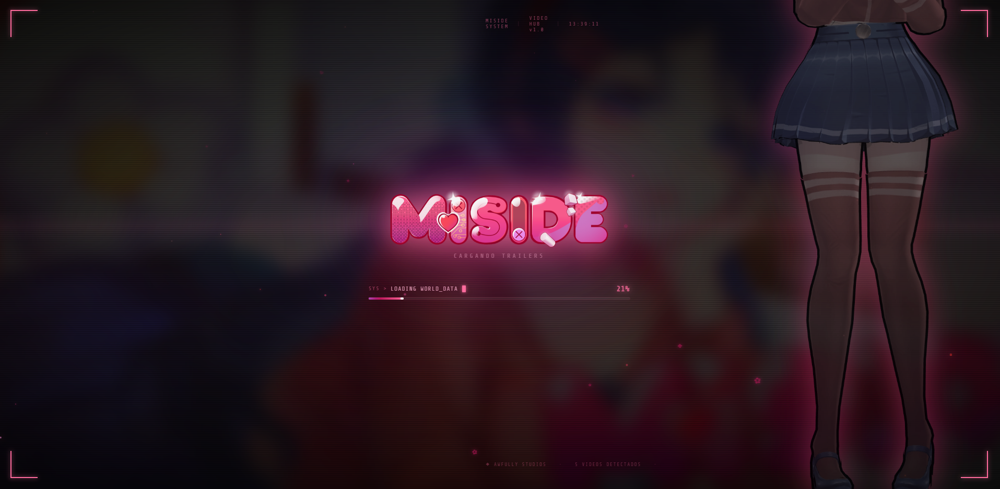
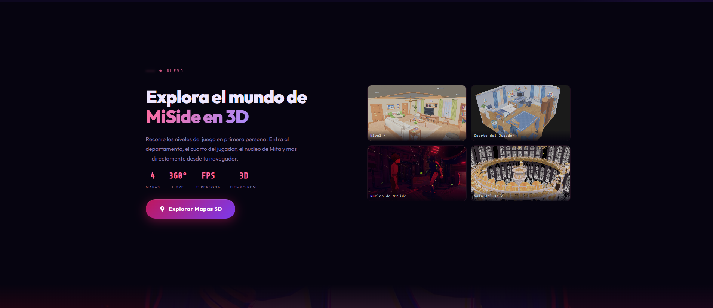

<div align="center">


# 🌸 MISide: Pacify Mode

### Fan Site Interactivo · Proyecto No Oficial

[](https://developer.mozilla.org/es/docs/Web/HTML)
[](https://developer.mozilla.org/es/docs/Web/CSS)
[](https://developer.mozilla.org/es/docs/Web/JavaScript)
[](https://threejs.org/)
[](https://web.dev/progressive-web-apps/)

[](./terminos.html)
[]()
[]()
[]()

> *"Un mundo en el que la dulzura esconde algo más profundo."*

Fan site interactivo **100% estático** dedicado al juego **MiSide** de **Awfully Studios**.
Explora personajes, mapas en 3D, galería de imágenes, trailers y la banda sonora oficial.

**[🌐 Ver Sitio en Vivo](https://dazzaz.github.io/miside-pacify-mode/)** · **[🐛 Reportar un Bug](../../issues/new?template=bug_report.md)** · **[💡 Sugerir Feature](../../issues/new?template=feature_request.md)**

</div>

---

## 📋 Tabla de Contenidos

- [📸 Preview](#-preview-del-sitio)
- [✨ Características](#-características)
- [🛠️ Stack Tecnológico](#️-stack-tecnológico)
- [📁 Estructura del Proyecto](#-estructura-del-proyecto)
- [🚀 Instalación y Uso Local](#-instalación-y-uso-local)
- [🎨 Sistema de Diseño](#-sistema-de-diseño)
- [📄 Mapa de Páginas y Scripts](#-mapa-de-páginas-y-scripts)
- [🗺️ Explorador de Mapas 3D](#️-explorador-de-mapas-3d)
- [📱 PWA — Progressive Web App](#-pwa--progressive-web-app)
- [🌐 Despliegue](#-despliegue)
- [🙏 Créditos](#-créditos)
- [⚠️ Aviso Legal](#️-aviso-legal)

---

## 📸 Preview del Sitio

<table>
  <tr>
    <td align="center">
      
      <br/><sub><b>🏠 Landing Page</b> — Hero cinematic, parallax y partículas animadas</sub>
    </td>
    <td align="center">
      
      <br/><sub><b>⚡ Preloader</b> — Pantalla de carga temática con efecto glitch</sub>
    </td>
  </tr>
  <tr>
    <td align="center" colspan="2">
      
      <br/><sub><b>🗺️ Mapa 3D</b> — Navegación en tiempo real por los escenarios del juego vía Three.js</sub>
    </td>
  </tr>
</table>

---

## ✨ Características

| Sección | Descripción |
|:---|:---|
| 🏠 **Inicio** | Landing page con hero animado, partículas, parallax y secciones de features, trailers, galería y OST |
| 👤 **Personajes** | 13 perfiles interactivos con modal de detalle, imágenes, roles y descripciones |
| 📖 **Historia / Lore** | Cronología completa, teorías del universo, mundos paralelos y secretos de MiSide |
| 🎬 **Trailers** | Reproductor de video con tabs para toda la videografía oficial del juego |
| 🗺️ **Mapa 3D** | Explorador interactivo de escenarios con modelos GLB cargados vía **Three.js** |
| 🖼️ **Galería** | +150 imágenes con filtros por categoría, buscador en tiempo real y lightbox con miniaturas |
| 🎵 **Banda Sonora** | Reproductor completo del OST con 24 pistas, shuffle, repeat, barra de progreso y volumen |
| 🎮 **Alpha** | Arte conceptual, renders exclusivos y trailers de la versión Alpha del juego |
| ⚖️ **Términos** | Aviso legal y política de privacidad del proyecto |
| ❌ **404** | Página de error personalizada con terminal animado y partículas |

---

## 🛠️ Stack Tecnológico

| Tecnología | Uso |
|:---|:---|
| **HTML5 semántico** | Estructura limpia, accesible y sin dependencias |
| **CSS3 Vanilla** | Sistema de diseño con variables, glassmorphism, animaciones y diseño responsive |
| **JavaScript ES6+** | Sin frameworks, sin build step, puro vanilla |
| **[Three.js](https://threejs.org/)** | Renderizado WebGL de modelos 3D `.glb` para el explorador de mapas |
| **Google Fonts** | Tipografías `Outfit` + `Share Tech Mono` |
| **PWA** | Progressive Web App instalable con Service Worker y Web App Manifest |

> ✅ **Zero dependencias de Node.js** · ✅ **Sin bundler** · ✅ **Abre `index.html` y listo**

---

## 📁 Estructura del Proyecto

```
MISide Pacify Mode/
│
├── 📄 index.html              # Página principal (landing page)
├── 📄 personajes.html         # Perfiles de los 13 personajes
├── 📄 lore.html               # Historia, cronología y teorías
├── 📄 trailers.html           # Reproductor de trailers oficiales
├── 📄 galeria.html            # Galería de imágenes con filtros
├── 📄 banda-sonora.html       # Reproductor del OST completo
├── 📄 mapa.html               # Explorador 3D de escenarios
├── 📄 alpha.html              # Contenido de la versión Alpha
├── 📄 terminos.html           # Términos de uso y privacidad
├── 📄 404.html                # Página de error personalizada
│
├── 📁 css/
│   ├── style.css              # Estilos globales + sistema de tokens
│   ├── preloader.css          # Animación de pantalla de carga
│   ├── transitions.css        # Efectos de transición entre páginas
│   ├── legal-banner.css       # Banner de consentimiento de cookies
│   ├── pwa.css                # Estilos del botón de instalación PWA
│   └── [pagina].css           # Hoja de estilos específica por página
│
├── 📁 js/
│   ├── script.js              # Lógica global (navbar, parallax, partículas, video)
│   ├── preloader.js           # Control de la pantalla de carga
│   ├── transitions.js         # Efectos glitch entre navegación
│   ├── legal-banner.js        # Consentimiento de cookies
│   ├── pwa.js                 # Registro del Service Worker
│   └── [pagina].js            # Lógica específica por página
│
├── 📁 assets/
│   ├── Character/             # Sprites y renders de personajes
│   ├── Gallery/               # +150 imágenes de galería
│   ├── Soundtracks/           # 24 pistas de audio (.mp3 / .wav)
│   ├── Trailers/              # Videos del juego (.mp4)
│   ├── Renders/               # Renders oficiales y de anuncio
│   ├── Logo/                  # Logos del juego y del proyecto
│   ├── Maps/                  # Modelos 3D (.glb) para el explorador
│   ├── 2D Art/                # Arte 2D oficial y fan art
│   ├── Alpha Concepts/        # Arte conceptual de la versión Alpha
│   ├── Open Graph/            # Imágenes para previews en redes sociales
│   └── Readme/                # Capturas de pantalla para este README
│
├── 📄 manifest.json           # Configuración de la PWA
├── 📄 sw.js                   # Service Worker (cache-first)
├── 📄 robots.txt              # Directivas para motores de búsqueda
└── 📄 sitemap.xml             # Mapa del sitio para SEO
```

---

## 🚀 Instalación y Uso Local

No se necesita ningún servidor ni instalación de dependencias. Elige una opción:

```bash
# Opción 1 — Python (recomendado para evitar errores CORS con los .glb)
python -m http.server 5500
# Luego abre: http://localhost:5500

# Opción 2 — Node.js (live-server)
npx live-server

# Opción 3 — Live Server en VS Code
# Click derecho en index.html → "Open with Live Server"

# Opción 4 — Abrir directamente (solo funciona sin el Mapa 3D)
# Doble clic en index.html
```

> **⚠️ Nota importante:** El explorador de mapas 3D requiere un servidor local para cargar los archivos `.glb`. Si abres el archivo directamente en el navegador obtendrás errores de CORS en esa sección. Todas las demás páginas funcionan correctamente sin servidor.

---

## 🎨 Sistema de Diseño

Los tokens de diseño están definidos como CSS custom properties en `css/style.css`, lo que permite mantener consistencia visual en todo el proyecto:

```css
:root {
    /* Paleta de color */
    --pink:       #ff6b9d;    /* Color de acento principal */
    --pink-light: #ffb3d1;    /* Variante clara del rosa */
    --cyan:       #00d4ff;    /* Color secundario / hover */

    /* Fondos y superficies */
    --bg:         #060410;    /* Fondo base oscuro */
    --surface:    rgba(255, 255, 255, 0.04); /* Glassmorphism */

    /* Tipografía */
    --font:       'Outfit', sans-serif;
    --mono:       'Share Tech Mono', monospace;
}
```

---

## 📄 Mapa de Páginas y Scripts

Cada página tiene su propio archivo CSS y JS. Todos comparten el conjunto de scripts globales.

| Página | CSS | JS |
|:---|:---|:---|
| `index.html` | `style.css` | `script.js` |
| `personajes.html` | `personajes.css` | `personajes.js` |
| `lore.html` | `lore.css` | `lore.js` |
| `trailers.html` | `trailers.css` | `trailers.js` |
| `galeria.html` | `galeria.css` | `galeria.js` |
| `banda-sonora.html` | `banda-sonora.css` | `banda-sonora.js` |
| `mapa.html` | `mapa.css` | `mapa.js` + **Three.js CDN** |
| `alpha.html` | `alpha.css` | `alpha.js` |
| `terminos.html` | `terminos.css` | `terminos.js` |
| `404.html` | `404.css` | `404.js` |

> 📌 Todos los archivos HTML comparten: `preloader`, `legal-banner`, `transitions` y `pwa`.

---

## 🗺️ Explorador de Mapas 3D

El explorador utiliza **Three.js r165** con `OrbitControls` para renderizar modelos `.glb` en tiempo real directamente en el navegador, sin necesidad de plugins ni instalaciones.

**Características:**
- 🏔️ **4 mapas** cargables: Nivel 4, Cuarto del Jugador, Núcleo de Mita, Sala del Jefe
- 🖱️ Controles de órbita con ratón y soporte táctil (touch)
- ⏳ Preloader animado por modelo con barra de progreso
- 🎥 Cámara libre con rotación 360°
- 💡 Renderizado en tiempo real con iluminación ambiental + HDRI

---

## 📱 PWA — Progressive Web App

El sitio es instalable como aplicación nativa en dispositivos móviles y escritorio:

| Archivo | Descripción |
|:---|:---|
| `manifest.json` | Nombre, colores, iconos y accesos directos a páginas clave |
| `sw.js` | Caché estático con estrategia *cache-first* para carga offline |

> **Nota:** Los archivos `.glb` se excluyen del caché (por su peso) y se descargan siempre frescos desde el servidor.

---

## 🌐 Despliegue

El sitio es **100% estático** y no requiere backend. Puede alojarse en cualquiera de estas plataformas de forma gratuita:

| Plataforma | Método de despliegue | Gratuito |
|:---|:---|:---:|
| **GitHub Pages** | Push al repositorio + activar Pages desde Settings | ✅ |
| **Netlify** | Drag & drop de la carpeta o conectar con GitHub | ✅ |
| **Vercel** | Importar repositorio desde GitHub | ✅ |
| **Hosting propio** | Upload vía FTP/SFTP | Depende |

### ⚙️ Configuración previa al despliegue

Antes de subir el proyecto, actualiza las URLs en los siguientes archivos:

```
robots.txt  → Sitemap: https://TU-DOMINIO.com/sitemap.xml
sitemap.xml → Reemplaza "https://TU-DOMINIO.com" en todas las entradas
```

---

## 🙏 Créditos

| Rol | Detalle |
|:---|:---|
| 🎮 **Juego original** | [MiSide](https://store.steampowered.com/app/2527500/MiSide/) por **Awfully Studios** |
| 💻 **Desarrollo del fan site** | **Dazzaz Dev** |
| 🎨 **Fan art de la galería** | Creadores individuales de la comunidad de MiSide |
| 🎵 **Banda sonora** | OST oficial de MiSide — Awfully Studios |

---

## ⚠️ Aviso Legal

Este es un **proyecto fan completamente no oficial**. No está afiliado, respaldado ni patrocinado por Aihasto ni Awfully Studios.

Todo el contenido del juego (imágenes, música, nombres de personajes, modelos 3D) pertenece a sus respectivos titulares de derechos de autor. Este proyecto fue creado exclusivamente con **fines creativos y de divulgación** para la comunidad de MiSide, sin ningún propósito comercial.

---

<div align="center">


**© 2026 MISide: Pacify Mode — Fan Site · Dazzaz Dev**

*Hecho con ❤️ para la comunidad de MiSide*

[](https://store.steampowered.com/app/2527500/MiSide/)

</div>
